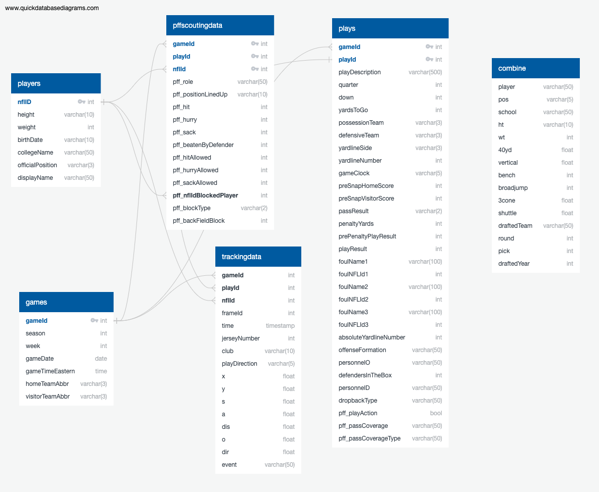
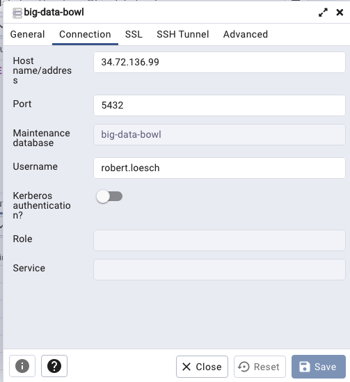
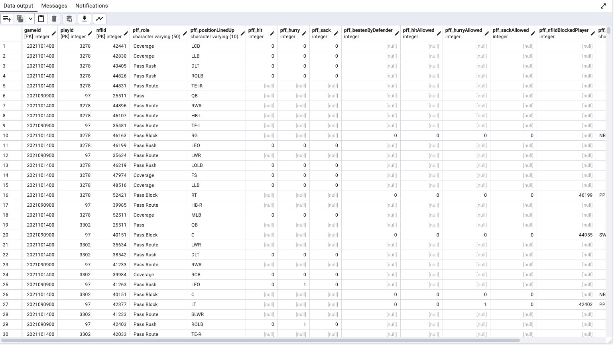

# Database Information

The following sections contain details about the database.

The data for the competition is available at [NFL Big Data Bowl 2023](https://www.kaggle.com/competitions/nfl-big-data-bowl-2023/data).

## Data files uploaded and available on Google Cloud Storage

https://storage.googleapis.com/big-data-bowl/games.csv

https://storage.googleapis.com/big-data-bowl/pffScoutingData.csv

https://storage.googleapis.com/big-data-bowl/players.csv

https://storage.googleapis.com/big-data-bowl/plays.csv

https://storage.googleapis.com/big-data-bowl/week1.csv

https://storage.googleapis.com/big-data-bowl/week2.csv

https://storage.googleapis.com/big-data-bowl/week3.csv

https://storage.googleapis.com/big-data-bowl/week4.csv

https://storage.googleapis.com/big-data-bowl/week5.csv

https://storage.googleapis.com/big-data-bowl/week6.csv

https://storage.googleapis.com/big-data-bowl/week7.csv

https://storage.googleapis.com/big-data-bowl/week8.csv


## Database Configuration Settings
PostgreSQL 14

Public IP: 34.72.136.99

Port: 5432

Instance ID: big-data-bowl

Table Names: players, games, plays, pffscoutingdata, trackingdata

Note: The table trackingdata contains the tracking data for weeks 1-8


## Database Schema

The schema definition that was used to create the database tables is in the [schema.sql](./schema.sql) file.



[Schema Definition](./schema.rtf)


## Database Connection

Each user will be provided a unique username and password for the database connection.

To connect to the database from pgAdmin, use the following configuration settings:





To connect to the database from a notebook, use the following configuration:

```
# Configure settings for Cloud SQL
mode = "append"
jdbc_url="jdbc:postgresql://34.72.136.99:5432/big-data-bowl"
config = {"user":"postgres", 
          "password": password, 
          "driver":"org.postgresql.Driver"}
```

## ETL

Scripts to load the data into the database are provided as PySpark in Jupyter notebooks:

[Games ETL Notebook](games_etl_gcs_cloudsql.ipynb)

[Players ETL Notebook](players_etl_gcs_cloudsql.ipynb)

[Plays ETL Notebook](plays_etl_gcs_cloudsql.ipynb)

[Tracking Data ETL Notebook](trackingData_etl_gcs_cloudsql.ipynb)

[PFF Scouting Data ETL Notebook](pffScoutingData_etl_gcs_cloudsql.ipynb)


## Database Preview 

The following images contain a preview of the database tables.

**Players Table Preview**

The players table contains 1,679 records.


**Games Table Preview**

The games table contains 122 records.


**Plays Table Preview**

The plays table contains 8,557 records.


**PFF Scouting Data Preview**

The pffscoutingdata table contains 188,254 records.


**Tracking Data Preview**

The trackingdata table contains 8,314,178 records.


## Provisional ML Model

A simple provisional ML model for analysis is provided in the [NFL Big Data Analysis Provisional ML Model](nfl_big_data_analysis_pd.ipynb) notebook.  The provisional ml model looks at simple statistics for Players and the correlation between height, weight, and age.