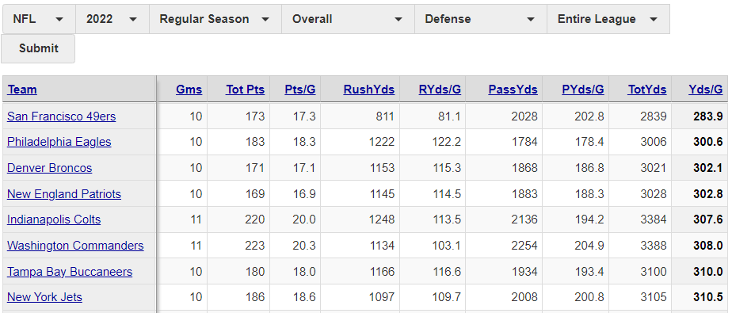
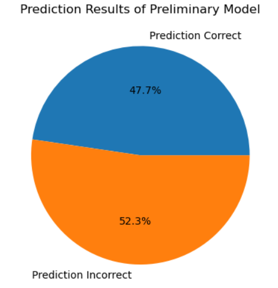
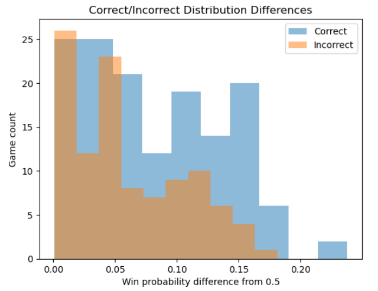

# Machine Learning

This section contains the machine learning model.

## Model Description

This model seeks to predict win results in NFL regular season games.

### Data Preprocessing

#### Data Source(s)

Historical stats (2011 through 2021) and game results data were gathered from: https://www.footballdb.com/

#### Processing Procedure

1. Offensive and defensive stats of both the home and visiting teams were merged for each game.
2. Each game was split into two rows, separating the home team and the visiting team.
3. Each row was sliced to include only the offensive team stats and the opponent's defensive team stats.
4. Scores from the historical game results were merged with the stats from the previous season.
5. A boolean column was added to define which team claimed victory using the score results.

### Features

#### Engineering and Selection

The team stats made publicly available at https://www.footballdb.com/ were all selected as features in this model. These include:
* Games
* Total Points
* Points per Game
* Rush Yards
* Rush Yards per Game
* Pass Yards
* Pass Yards per Game
* Total Yards
* Yards per Game

#### Decision-making process

The features in this model, by design, only consider historical data to allow predictions for the entire season to be made before a game has been played. To protect against long-term shifts in the roster, staffing and other long-term trends within teams, the model is trained to make predictions based solely on the previous season's team stats.

### Defining Training and Testing Sets

Training and testing data sets were defined with a 20% test size considering all game results prior to the 2021 season. Results were also tested for 2020 stats against actual 2021 season results.

### Model Choice

#### Preliminary Model

A preliminary logistic regression model was created to predict win outcomes.

##### Training and Testing Split

After fitting the model to historical data prior to 2020, 2020 stats were used as testing data to evaluate how well the model could predict our target dataset.

##### Results

The model had an R-squared value of 0.564, however, when applying the model to predict win outcomes in 2021, the model performed with a test accuracy below 50% - worse odds than flipping a coin. 

##### Limitations

While this model takes a very streamlined approach to predicting wins, it ultimately underperformed at an unacceptable level. This is likely due to features being too broad and lacking meaningful connection to the y-variable of win prediction. The production model addresses this concern.

#### Production Model

A production model was created to isolate how offensive teams perform against defensive teams. With both offensive and defensive team stats combined with game score results from https://www.footballdb.com/, a new linear regression model can be trained to predict how many points an offensive team could score against a rivaling defensive team.

##### Training and Testing Split

A similar method to the preliminary model was used to split training and testing data. The model was trained on historical data and 2021 predictions were evaluated as testing data.

##### Results

The model was able to predict 2021 win outcomes at a 59.2% success rate. Considering the many confounding variables (weather, ccoaching, roster, injuries) that affect game performance, this result can be deemed successful.

##### Evaluation

Using an F-test, the variances in the distributions of correct and incorrect predictions was statistically significant with a p-value of 0.047. We can reject the null hypothesis that the difference in win percentage predictions can't be used as a reasonable prediction.

